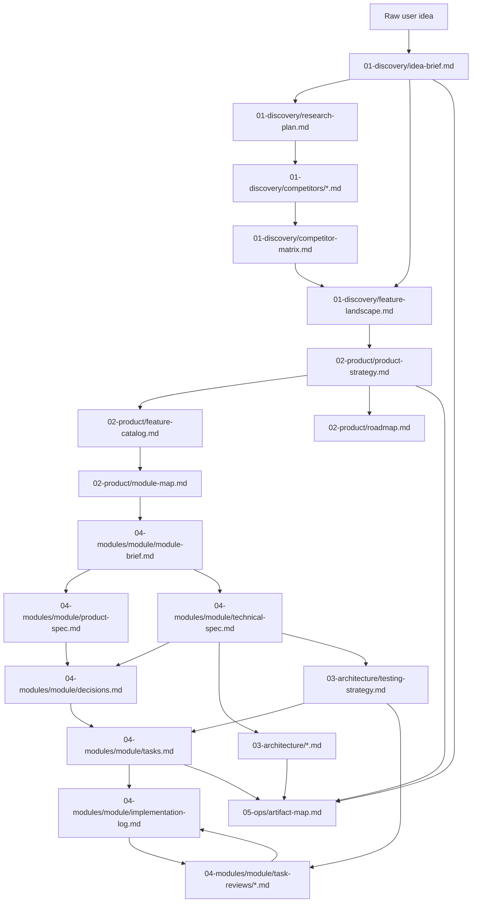
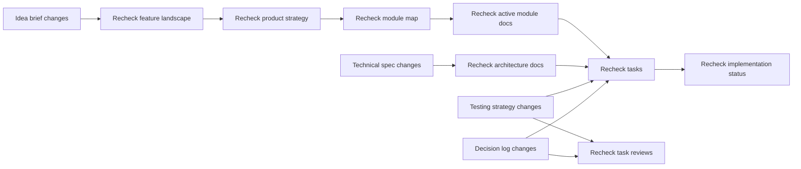

# Artifact Governance

Use this skill whenever product, architecture, module, task, or decision artifacts are created or changed.

Use `artifact_language` from `00-index.md`. Keep `00-index.md` current whenever the workflow state changes.

## Contract

Input:

- Changed artifact path or planned artifact update.
- Current `docs/wefter/` tree.

Output:

- Updated `docs/wefter/05-ops/artifact-map.md`.
- Updated `docs/wefter/05-ops/change-propagation.md`.
- Updated `docs/wefter/05-ops/human-review-queue.md` when review is needed.

Complexity:

- Low: only mark blocking stale artifacts.
- Medium: standard dependency and propagation tracking.
- High: fuller traceability and review queue detail.

## Artifact Boundaries

- Discovery explains problem, market, competitors, and possible features.
- Product docs explain positioning, selected features, modules, and roadmap.
- Architecture docs explain cross-module technical direction.
- Module docs explain one module in detail.
- Task docs explain implementation units for one module.
- Ops docs explain document dependencies, stale risk, and review state.

## Propagation Rules

- Upstream changes can make downstream docs stale.
- Downstream discoveries can propose updates upstream, but should not silently rewrite strategy.
- Mark stale docs explicitly when a full update is not safe in the current step.
- Avoid duplicated truth. If two docs overlap, clarify ownership in `artifact-map.md`.

## Artifact Map Requirements

`artifact-map.md` must include:

- Generated artifact tree.
- Mermaid graph of generation dependencies.
- Mermaid graph of propagation paths.
- Table of artifact ownership and boundaries.
- Table of stale/update rules.
- A reference to `00-index.md` as the workflow state source of truth.

## Artifact Map Template

````markdown
---
artifact: artifact-map
stage: ops
status: draft
owner_agent: artifact-cartographer
depends_on:
  - docs/wefter/**/*.md
feeds:
  - docs/wefter/05-ops/change-propagation.md
  - docs/wefter/05-ops/human-review-queue.md
human_review: optional
last_updated: YYYY-MM-DD
language: <artifact_language>
---

# Artifact Map

## Tree

```text
docs/wefter/
  00-index.md
  01-discovery/
    idea-brief.md
    research-plan.md
    competitors/<product-slug>.md
    competitor-matrix.md
    feature-landscape.md
  02-product/
    product-strategy.md
    feature-catalog.md
    module-map.md
    roadmap.md
  03-architecture/
    system-context.md
    architecture-decision-log.md
    data-model.md
    integration-map.md
    security-privacy.md
    testing-strategy.md
  04-modules/
    <module-id>/
      module-brief.md
      product-spec.md
      technical-spec.md
      decisions.md
      tasks.md
      implementation-log.md
      task-reviews/<task-id>.md
  05-ops/
    artifact-map.md
    change-propagation.md
    human-review-queue.md
```

## Generation Graph



## Propagation Graph


````

## Change Propagation Template

```markdown
# Change Propagation

| Changed Artifact | Potentially Stale Artifacts | Required Action | Owner | Status |
| --- | --- | --- | --- | --- |
```

## Human Review Queue Template

```markdown
# Human Review Queue

| Artifact | Reason | Blocking? | Requested Decision | Status |
| --- | --- | --- | --- | --- |
```
