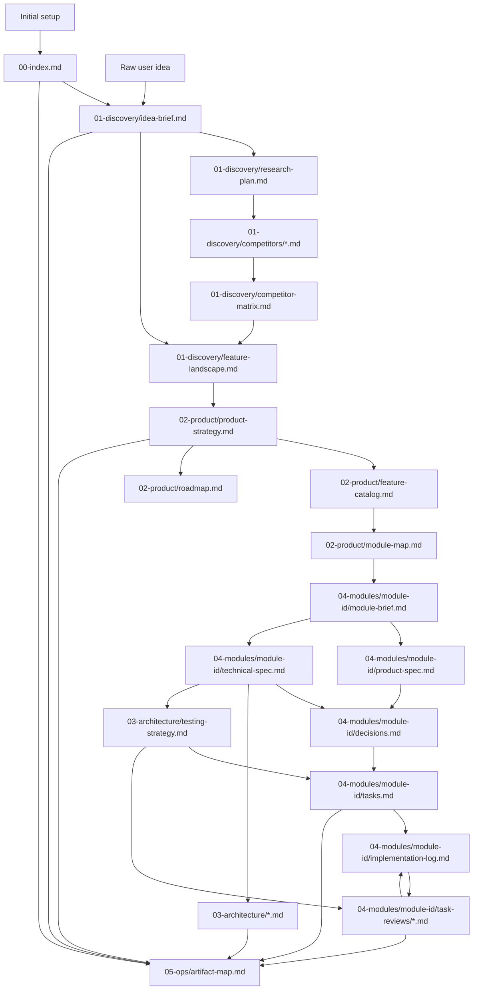
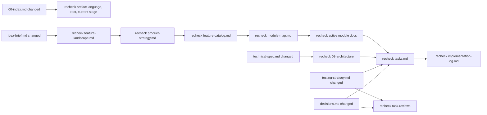

# Artifact Map Template

Copy this structure into `docs/wefter/05-ops/artifact-map.md` in a target repository, then keep it updated as artifacts are created or changed.

## Template

````markdown
---
artifact: artifact-map
stage: ops
status: draft
owner_agent: artifact-cartographer
language: <artifact_language>
depends_on:
  - docs/wefter/**/*.md
feeds:
  - docs/wefter/05-ops/change-propagation.md
  - docs/wefter/05-ops/human-review-queue.md
human_review: optional
last_updated: YYYY-MM-DD
---

# Artifact Map

## Generated Tree

```text
docs/wefter/
  00-index.md
  01-discovery/
    idea-brief.md
    research-plan.md
    competitors/
      <product-slug>.md
    competitor-matrix.md
    feature-landscape.md
  02-product/
    product-strategy.md
    feature-catalog.md
    module-map.md
    roadmap.md
  03-architecture/
    system-context.md
    architecture-decision-log.md
    data-model.md
    integration-map.md
    security-privacy.md
    testing-strategy.md
  04-modules/
    <module-id>/
      module-brief.md
      product-spec.md
      technical-spec.md
      decisions.md
      tasks.md
      implementation-log.md
      task-reviews/
        <task-id>.md
  05-ops/
    artifact-map.md
    change-propagation.md
    human-review-queue.md
```

## Generation Graph



## Propagation Graph



## Ownership Table

| Artifact | Source Of Truth For | Depends On | Feeds | Owner |
| --- | --- | --- | --- | --- |
| `idea-brief.md` | Problem, users, assumptions | Raw idea | Research, feature landscape | `discovery-strategist` |
| `product-strategy.md` | Positioning and tradeoffs | Feature landscape | Feature catalog, module map | `product-refiner` |
| `technical-spec.md` | Active module technical approach | Module brief, codebase | Decisions, testing strategy, tasks | `module-architect` |
| `testing-strategy.md` | TDD approach and verification boundaries | Technical spec | Tasks, implementation log, reviews | `module-architect` |
| `tasks.md` | TDD-ready implementation task contracts | Module specs, decisions, testing strategy | Implementation log, reviews | `task-planner` |

## Stale Propagation Table

| Changed Artifact | Downstream Risk | Required Action | Blocking? |
| --- | --- | --- | --- |
| `product-strategy.md` | Feature/module docs may conflict with positioning | Recheck catalog and module map | Yes if active module scope changes |
| `technical-spec.md` | Tasks may implement wrong approach | Recheck decisions and tasks | Yes before development continues |
| `testing-strategy.md` | Tasks or reviews may miss required TDD coverage | Recheck task TDD plans and review criteria | Yes before development continues |
| `decisions.md` | Code/reviews may not match accepted choice | Recheck active task and review notes | Maybe |
````
